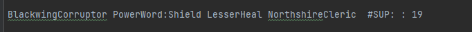
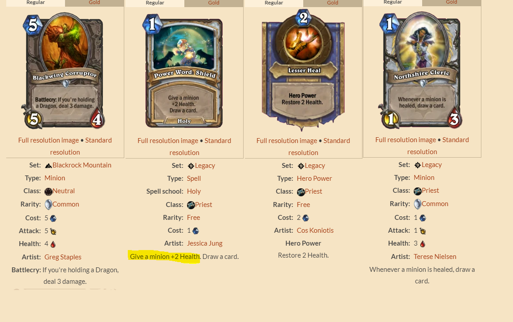

# TP4_IA

####Transformation appliquées aux données

la transformation des données de fait en plusieurs étape :
    
**1.** On parcourt une première fois le fichier qui nous ait données et on associe un numéro unique à chaque carte
    
**2.**  On parcourt une deuxième fois le fichier, pour chaque partie on créer deux listes qu'ont remplies avec les numéros
        associé aux cartes jouées  (une liste pour chaque joueur). Ces listes d'entier seront ensuite écrites dans le fichier
        inputfile donnée à l'algorithme LCM
    
**3.**  On exécute l'algorithme LCM, on obtient les résultats dans le fichier inputFile qu'on va traduire pour la rendre plus lisible 
    (les numéros seront remplacés par les noms des cartes). La traduction se trouve dans un dernier fichier nommé readbleoutputfile.

####Analyse des résultats

**Que représente un itemset fréquent fermé ici ? pourquoi est-ce
potentiellement intéressant ?**  

Un itemset fréquent fermé représente ici les cartes qui sont généralement jouées ensemble alors
d'une partie. Cela est intéressant pour connaitre les combinaisons de cartes qui sont le plus jouée 

**Y a-t-il des itemsets fréquents fermés « triviaux » qui ne nous apprennent
pas grand-chose ?**  

lorsque l'itemsets est égale à 1 item, cela ne nous apprend pas grand-chose, excepté que la carte est souvent jouée

**Avez-vous trouvé des itemsets fréquents particulièrement intéressants ?**  

Exemple de combinaison qui se retrouve dans 19 parties : 

on a deux cartes de type serviteur, BlackwingCorruptor et NorthshireCleric, cette dernière fait gagner une nouvelle carte si un serviteur est soigné  
On a deux autres cartes, une carte de soin et une deuxième carte qui soigne seulement les serviteurs 

On comprend pourquoi la combinaison de ces 4 cartes revient régulièrement pendant les différente parties

